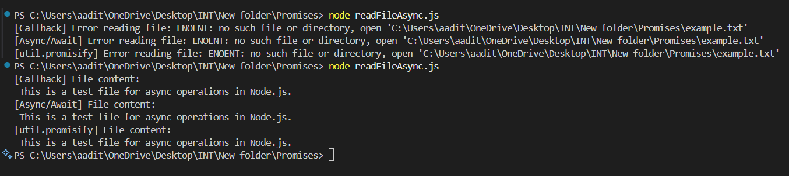

#  Node.js Async File Reader Tool

This is a simple file reader utility built using Node.js core modules. It demonstrates **three different approaches** to handle asynchronous file operations:

Using **Callbacks**  
Using **Async/Await with Promises**  
Using **`util.promisify`** for legacy support  

This tool reads content from a text file (like `example.txt`) and prints it to the console with proper error handling.

---

##  Modules Used

| Module        | Purpose                                                                 |
|---------------|-------------------------------------------------------------------------|
| `fs`          | To perform file operations using callbacks                              |
| `fs.promises` | To work with the modern Promise-based API                               |
| `path`        | To safely resolve file paths relative to the script                     |
| `util`        | To convert callback-based functions to Promise-based ones (`promisify`) |
---

## Features

- Read file content using classic **callback** style  
- Read file content using **async/await** with `fs.promises`  
- Read file using `util.promisify` for legacy APIs  
- Clean and consistent **error handling**  
- Console output formatted clearly for each method

---

## Project Structure

- Promises/
- |─ example.txt       
- |── readFileAsync.js    

## Screenshots 
### 1. Create File Request

